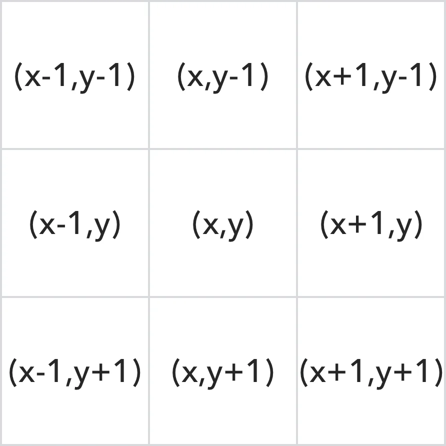

## **Parallel Programming**
# Joker - Project :rocket:
### Images transformation

---

<!-- paginate: true -->

# **Introducción**

<div class="column">
<p>

Herramienta de transformación de imágenes. Desde `escala a grises`, `redimensionamiento`, hasta filtros de convolución (`desenfoque gaussiano`). Comparando el rendimiento de la versión secuencial y paralela.

</p>

<div class="row">


</div>

</div>

---

## **Generalidades:**

- **Project**: Images transformation
- **Language**: C++
- **Library**: [stb (`stb_image` `stb_image_write`)](https://github.com/nothings/stb)
- **IDE**: Visual Studio Code

---

#  1. Escala a grises :eight_pointed_black_star:


---

### 1.1. Explicación gráfica:


---

### 1.2. Explicación paralela:


**Donde:**
- `n` = Número total de núcleos de CPU disponibles.

---

### 1.3. Implementación:

```cpp
unsigned char *convertToGrayscaleParallel(unsigned char *data, int width, int height, int channels)
{
    unsigned char *grayscaleData = (unsigned char *)malloc(width * height);

    int numThreads = std::thread::hardware_concurrency();
    int rowsPerThread = height / numThreads;
    std::vector<std::future<void>> futures;

    for (int i = 0; i < numThreads; ++i)
    {
        int startRow = i * rowsPerThread;
        int endRow = (i == numThreads - 1) ? height : startRow + rowsPerThread;
        futures.emplace_back(std::async(std::launch::async, convertToGrayscaleThread, data, grayscaleData, width, height, channels, startRow, endRow));
    }

    for (auto &future : futures)
    {
        future.wait();
    }

    return grayscaleData;
}
```
---

```cpp
void convertToGrayscaleThread(unsigned char *data, unsigned char *grayscaleData, int width, int height, int channels, int startRow, int endRow)
{
    for (int y = startRow; y < endRow; y++)
    {
        for (int x = 0; x < width; x++)
        {
            // Calcular el valor promedio de los canales de color
            int sum = 0;
            for (int c = 0; c < channels; c++)
            {
                sum += data[(y * width + x) * channels + c];
            }
            int average = sum / channels;
            // Asignar el mismo valor a cada canal en la imagen en escala de grises
            grayscaleData[y * width + x] = average;
        }
    }
}
```

---

#  2. Redimensión :cyclone:
`Interpolación bilineal`


---

## 2.1. Explicación gráfica:

El proceso de interpolación bilineal implica calcular un `nuevo valor` para un píxel en la imagen redimensionada tomando en cuenta los `cuatro píxeles más cercanos` en la imagen original y `ponderando` sus valores `de acuerdo a su distancia relativa al píxel deseado`.

---


- $(x,y)$: Posición del píxel en la **imagen redimensionada**.
- $(px,py)$: Posición del píxel en la **imagen original**.
- $(ix,iy)$: Posición del **píxel superior izquierdo más cercano** en la imagen original.
- $(fx, fy)$: Factores de interpolación.
- $(weight_1, weight_2, weight_3, weight_4)$: Pesos de interpolación de los 4 píxeles más cercanos.

---


---

#  3. Desenfoque Gaussiano :cyclone:
`Gaussian Blur`


---

## 3.1. Explicación gráfica:

- Obtenemos el `kernel convolution` con la fórmula de distribución gaussiana en el espacio bidimensional es la siguiente:

$$G(x,y)=\frac{1}{2\pi{\sigma^2}}e^{-\frac{x^2+y^2}{2\sigma^2}}$$




---

- Alinear el centro del kernel de convolución con el elemento correspondiente de la matriz a procesar. Los elementos correspondientes se multiplican y suman para obtener el resultado.

<div class="row">


</div>

---

# Secuencial vs Paralelo